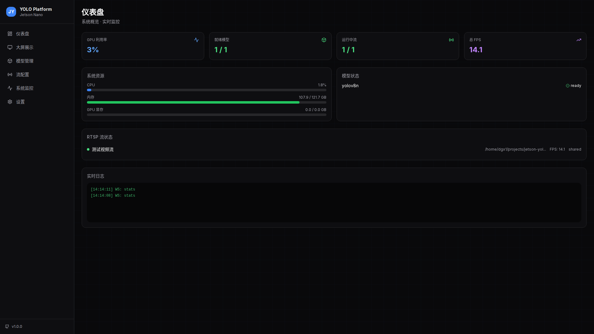
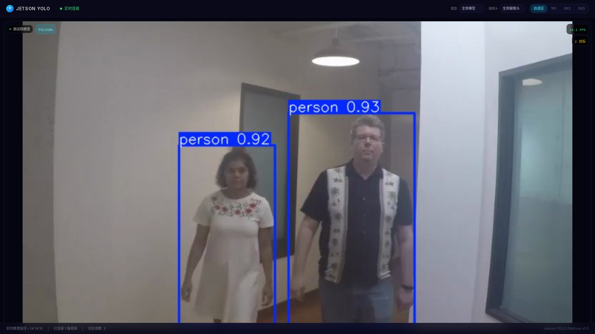
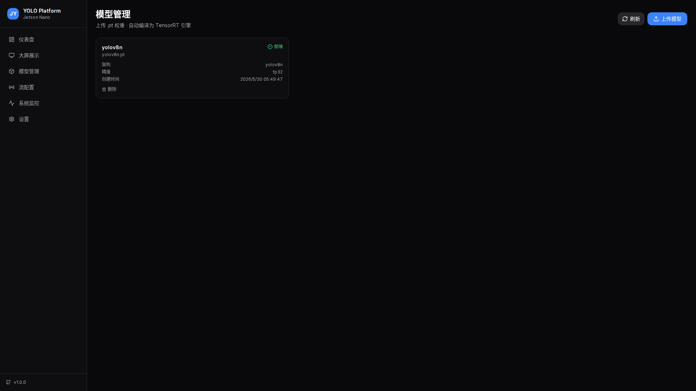
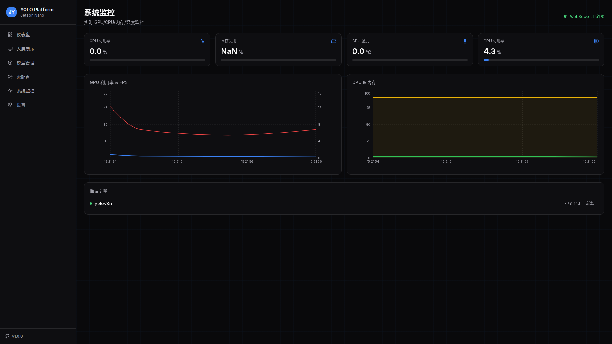

<p align="center">
  
</p>

<p align="center">
  <h1 align="center">🚀 Jetson YOLO Platform</h1>
  <p align="center">
    <em>AI-powered YOLO model deployment platform for <strong>Jetson Nano</strong> &bull; <strong>Jetson Orin</strong> &bull; <strong>DGX Spark</strong></em>
  </p>
</p>

<p align="center">
  <a href="#-features"></a>
  <a href="#-architecture"></a>
  <a href="#-quick-start"></a>
  
  
</p>

---

## ✨  Features

| | Feature | Description |
|---|---|---|
| 🎯 | **Upload & Compile** | Upload `.pt` weights, auto-compile to TensorRT `.engine` for maximum throughput |
| 📡 | **RTSP Streaming** | Configure up to **5+** real-time RTSP camera feeds with auto-reconnect |
| 🧠 | **3 Deployment Modes** | **Single-engine multi-stream** (memory saving) &bull; **Multi-engine multi-stream** (high performance) &bull; **Hybrid** (flexible binding) |
| 💻 | **Management Dashboard** | Web UI for model management, stream binding, FPS & GPU monitoring |
| 🖥️ | **Big Screen Display** | Real-time detection visualization with live MJPEG streams, per-stream stats, grid layout |
| 🔌 | **REST + WebSocket** | Full REST API + WebSocket for real-time stats & detection results push |
| 🐳 | **Docker One-Click** | ARM64 multi-stage Docker build, ready to run on any Jetson device |

---

## 📸  Screenshots

### Big Screen Display — Real-time Detection Monitor
<p align="center">
  
</p>
> Live MJPEG streams with bounding boxes • Per-stream FPS & detection count • Grid layout (auto/1×1/2×2/3×3) • Model/camera filters

### Dashboard — System Overview
<p align="center">
  
</p>
> GPU utilization • Model status • Stream health • Real-time FPS • System resource charts

### Model Management
<p align="center">
  
</p>
> Upload `.pt` weights • View compilation status • Delete models • Ready for TensorRT compile

### System Monitor
<p align="center">
  
</p>
> Live GPU/CPU/memory charts • WebSocket-connected real-time data • Temperature & fan speed

---

## 🏗️  Architecture

```
┌─────────────────────────────────────────────────────────────┐
│                     Docker Container (ARM64)                 │
├─────────────────────────────────────────────────────────────┤
│                                                              │
│   ⚡ FastAPI Backend                                          │
│   ├── REST API: model upload/management, deploy config       │
│   ├── WebSocket: real-time detection results + stats push    │
│   └── MJPEG Stream: live annotated frames for display        │
│                                                              │
│   🧩 Inference Engine Layer                                   │
│   ├── EnginePool: manage N TensorRT inference engines        │
│   ├── StreamManager: RTSP pull + auto-reconnect              │
│   └── Dispatcher: route streams to engines per YAML config   │
│                                                              │
│   💾 Storage Layer                                           │
│   ├── SQLite: model metadata, deploy configs, run logs       │
│   ├── /models/: uploaded .pt / .onnx files                   │
│   └── /engines/: compiled TensorRT .engine files             │
│                                                              │
├─────────────────────────────────────────────────────────────┤
│                                                              │
│   🎨 Next.js Frontend (Static Export)                        │
│   ├── /dashboard      — Overview + real-time grid            │
│   ├── /display        — Big screen detection wall            │
│   ├── /models         — Upload / list / delete models        │
│   ├── /streams        — RTSP config + model binding          │
│   ├── /monitor        — GPU/CPU/memory live charts           │
│   └── /settings       — Deployment mode configuration        │
│                                                              │
└─────────────────────────────────────────────────────────────┘
```

### 🔁  Inference Pipeline

```
RTSP Input → PyAV Decode → GPU Preprocess (resize/normalize)
  → TensorRT execute_async → NMS Post-process
  → WebSocket Push (bbox + class + confidence)
  → MJPEG Stream (annotated frame with bounding boxes)
```

---

## 🚀  Quick Start

### Prerequisites

- **NVIDIA Jetson** (Nano / Orin / Xavier) or any ARM64 + NVIDIA GPU machine
- **Docker** installed with NVIDIA Container Toolkit
- A YOLO `.pt` model weight file
- RTSP camera(s) or video file

### 1️⃣ One-Click Deploy

```bash
# Clone the repository
git clone https://github.com/gulugulupa33/jetson-yolo-platform.git
cd jetson-yolo-platform

# Run the deploy script
chmod +x deploy.sh
./deploy.sh
```

The script will:
- Check Docker & NVIDIA runtime
- Create directories for models, engines, and data
- Generate a default configuration
- Build the Docker image (first run: ~5-10 min)
- Start all services

### 2️⃣ Access the Web UI

```
Frontend:  http://<jetson-ip>:3000
Backend:   http://<jetson-ip>:8100/api/health
```

### 3️⃣ Manual Docker Build

```bash
# Build the image
docker compose build

# Start services
docker compose up -d

# View logs
docker compose logs -f
```

---

## ⚙️  Configuration

### Stream Bindings

Edit `docker-compose.yml` or use the Web UI to configure:

```yaml
stream_model_map:
  rtsp://camera1.local:554/stream1: yolov8n   # Engine A: streams 1+2
  rtsp://camera2.local:554/stream2: yolov8n
  rtsp://camera3.local:554/stream3: yolov8s   # Engine B: stream 3
  rtsp://camera4.local:554/stream4: yolov5    # Engine C: streams 4+5
  rtsp://camera5.local:554/stream5: yolov5
```

### Deployment Modes

| Mode | Description | Best For |
|------|-------------|----------|
| **Single-Engine Multi-Stream** | One engine serves multiple streams | Memory-constrained (Jetson Nano 4GB) |
| **Multi-Engine Multi-Stream** | Each stream gets dedicated engine | High FPS requirements |
| **Hybrid** (default) | Configurable binding per stream | General purpose |

### ⚠️ Important for Users

> **Replace the example RTSP URLs** (`rtsp://192.168.x.x:554/...`) with your actual camera addresses in the Web UI **Streams** page before starting inference.

---

## 📂  Project Structure

```
jetson-yolo-platform/
├── backend/                    # FastAPI backend
│   ├── main.py                 # App entry + lifespan
│   ├── config.py               # Configuration constants
│   ├── schemas.py              # Pydantic models
│   ├── routers/
│   │   ├── models.py           # Model CRUD API
│   │   ├── streams.py          # RTSP stream management API
│   │   ├── engine.py           # Engine pool API
│   │   ├── stats.py            # System stats API
│   │   ├── ws.py               # WebSocket endpoints
│   │   └── mjpeg.py            # MJPEG streaming endpoint
│   ├── services/
│   │   ├── engine_pool.py      # TensorRT engine lifecycle
│   │   ├── stream_manager.py   # RTSP stream lifecycle
│   │   ├── dispatcher.py       # Stream-to-engine routing
│   │   ├── model_compiler.py   # .pt → ONNX → .engine compilation
│   │   └── database.py         # SQLAlchemy async session
│   └── models/
│       └── database.py         # SQLAlchemy ORM models
├── frontend/                   # Next.js frontend
│   └── src/
│       ├── app/
│       │   ├── dashboard/      # System overview
│       │   ├── display/        # Big screen detection wall
│       │   ├── models/         # Model management
│       │   ├── streams/        # RTSP configuration
│       │   ├── monitor/        # Real-time charts
│       │   └── settings/       # Deploy config
│       └── lib/
│           ├── api.ts          # REST API client
│           └── websocket.ts    # WebSocket manager
├── run_demo.py                 # Local GPU inference demo
├── Dockerfile                  # Multi-stage ARM64 build
├── docker-compose.yml          # Service orchestration
├── nginx.conf                  # Reverse proxy config
├── deploy.sh                   # One-click deployment
└── screenshots/                # UI screenshots
```

---

## 🧪  Running the Demo Locally

Test the platform on your development machine without RTSP cameras:

```bash
# 1. Install dependencies
pip install ultralytics opencv-python-headless

# 2. Download a YOLOv8 model
wget -O backend/models/yolov8n.pt https://github.com/ultralytics/assets/releases/download/v8.2.0/yolov8n.pt

# 3. Start the demo runner (GPU inference on local video)
python run_demo.py

# 4. In another terminal, start the backend
cd backend && pip install -r requirements.txt
uvicorn main:app --host 0.0.0.0 --port 8000

# 5. Serve the frontend
cd frontend/out && python3 -m http.server 3000

# 6. Open browser
open http://localhost:3000/dashboard
open http://localhost:3000/display
```

> **Note:** The demo uses ultralytics PyTorch inference for cross-platform compatibility. On Jetson devices with TensorRT, performance will be significantly faster (2-5x).

---

## 🔧  Tech Stack

| Component | Technology |
|-----------|-----------|
| **Framework** | FastAPI + uvicorn (async) |
| **Database** | SQLite + SQLAlchemy (async) |
| **Model Compilation** | TensorRT (trtexec + Python API) |
| **RTSP Streaming** | PyAV (ffmpeg bindings) |
| **Real-time Push** | WebSocket (FastAPI native) |
| **Live Video Stream** | MJPEG (multipart/x-mixed-replace) |
| **Frontend** | Next.js 14 + TypeScript |
| **UI** | Tailwind CSS + shadcn/ui |
| **Charts** | Recharts |
| **Icons** | Lucide React |
| **Container** | Docker multi-stage (ARM64) |
| **Reverse Proxy** | Nginx |

---

## 📜  License

[MIT](LICENSE) © 2026

---

<p align="center">
  <sub>Built with ❤️ for the Edge AI community</sub>
</p>
